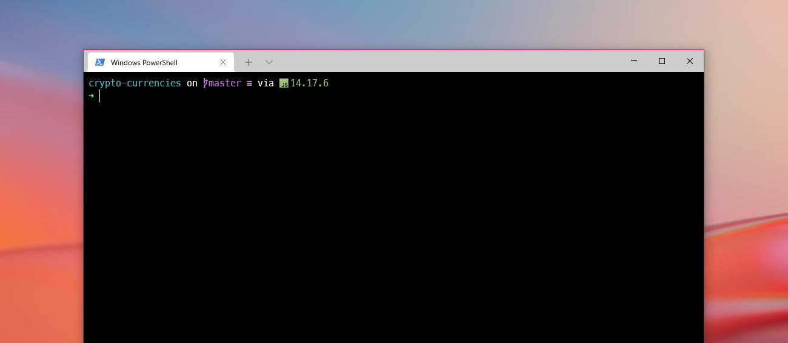
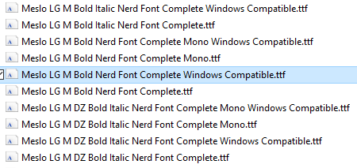
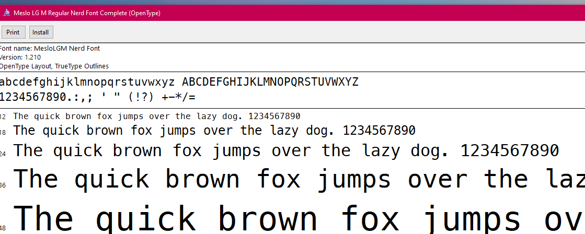
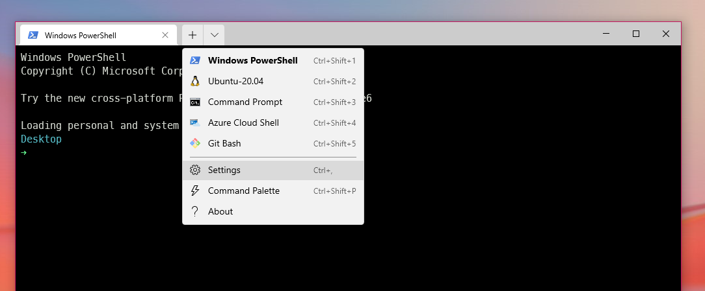
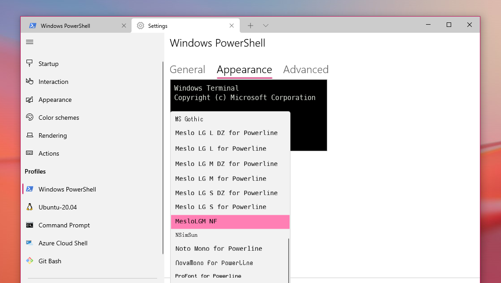
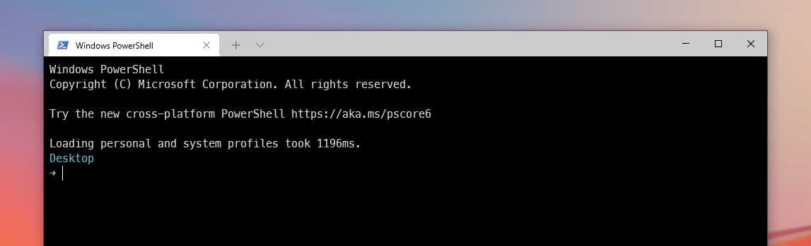
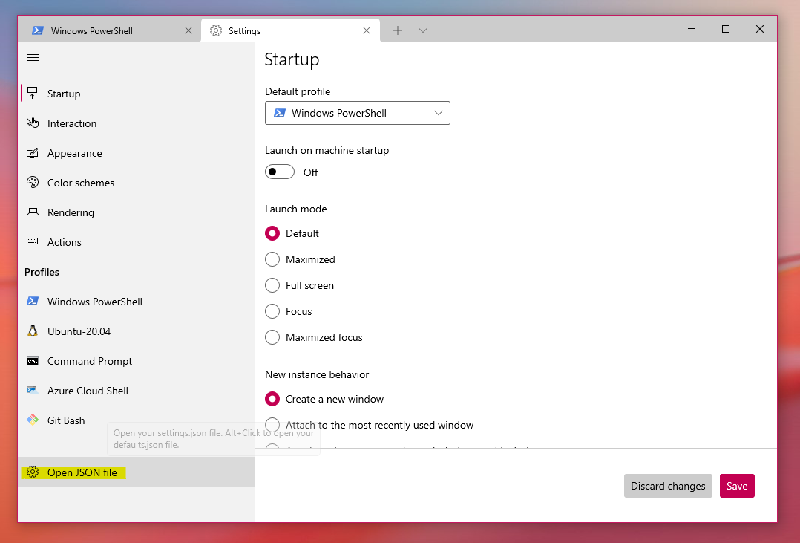
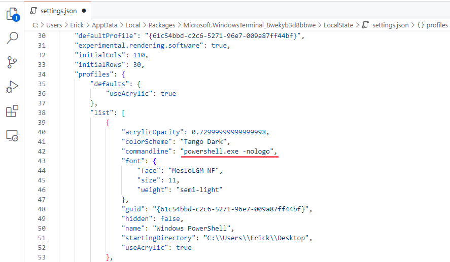
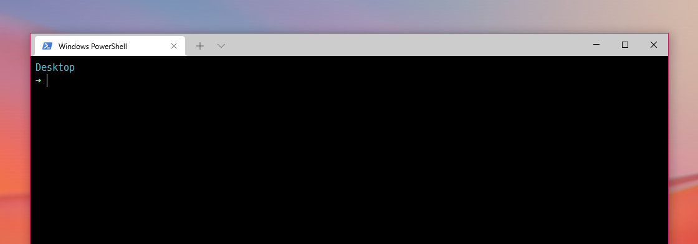

## First steps

Install [New Terminal](https://aka.ms/terminal).

There are different themes and settings for a nice look of your terminal. Many of these themes use special icons that are just for the purpose of customization (e.g github icon). And to avoid problems with the rendering of these icons and not have these annoying '▯' in console.

First we will start by installing a font with all these icons already included. The particular font is called [Meslo Nerd Font](https://github.com/ryanoasis/nerd-fonts/releases/download/v2.1.0/Meslo.zip). And it belongs to our friends at [Nerd Fonts](https://www.nerdfonts.com/#home), you can check out more fonts by checking out there page.

Extract the files and choose the source:



We install the font:



Once the font has been installed we proceed to customize PowerShell.

## Customizing PowerShell

To avoid problems with PowerShell when executing certain scripts we run this with administrator permissions from the PowerShell console:

```
Set-ExecutionPolicy -ExecutionPolicy RemoteSigned -Scope LocalMachine
```

### PowerShell prerequisites

If you don't already have it, [install Git for Windows](https://git-scm.com/downloads).

Using PowerShell, install Posh-Git and Oh-My-Posh:

```
Install-Module posh-git -Scope CurrentUser
Install-Module oh-my-posh -Scope CurrentUser
```

### Customize your PowerShell prompt

Open your PowerShell profile with `notepad $PROFILE` or the text editor of your choice.

In your PowerShell profile, add the following to the end of the file:

```
Import-Module posh-git
Import-Module oh-my-posh
Set-PoshPrompt -Theme name-theme
```

Replace "name-theme" with the name of the theme of your choice (e.g. agnoster). [Themes!](https://ohmyposh.dev/docs/themes)

Now you only have to restart or close and open the terminal again, to see the changes.

## Customize your terminal

Open the terminal settings:



We go to the PowerShell section and configure it as we wish but choosing the previously installed source:



We save all the changes, close and reopen the terminal and that's it. We have our configuration on screen:



I know. It looks horrible all that copyright marking next to my settings. Just one more thing and we're done.

We open again the terminal configuration, and choose "Open JSON file":



Now with your favorite editor (mine vscode) we edit the configuration part with PowerShell adding "-nologo":



And now we have it, our terminal clean and beautiful:



Note:

- To have the same configuration in the vscode integrated terminal we have to add this in the .json file of the settings:

  ```
  {
      "terminal.integrated.fontFamily": "MesloLGM NF",
      "terminal.integrated.shellArgs.windows": "-NoLogo"
  }
  ```

- If you still have problems with icon rendering, you can try installing this font [Caskaydia Cove Nerd Font](https://github.com/ryanoasis/nerd-fonts/releases/download/v2.1.0/CascadiaCode.zip) and configuring it on your terminal. Otherwise you can try any of the others in their [Nerd Fonts List](https://www.nerdfonts.com/font-downloads).

Thanks for making it this far, if you have any questions feel free to leave them in the comments. 🎉
