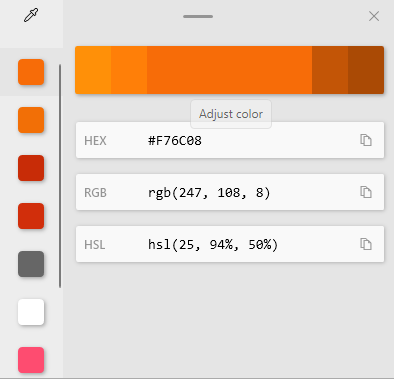

Many times its is very tedious to find the code of a specific color when you are searching the web. Whether it is for any work we are doing, be it a software interface or an advertising design among others.

Microsoft has had a lot of positive changes, since they started "embracing" open sourse. They have been adding many great things like [wsl2](https://docs.microsoft.com/en-us/windows/wsl/install-win10) and [winget](https://docs.microsoft.com/en-us/windows/package-manager/).

Now let's focus on a productivity tool called [Microsoft PowerToys](https://docs.microsoft.com/en-us/windows/powertoys/). It adds many features that add "superpowers" to the windows system as such. Among those features is a color picker that works great for any image or within the screen layout.

Here are some images:

_(Selecting a random color.)_

_(When selecting a color, this window shows the color code and its variants.)_

Now that we have seen the tool in action, let's see how to get it on our system. To do this we need to meet certain requirements before we can install it.

## Requirements:

- Windows 10 1803 (build 17134) or later.
- [.NET Core 3.1 Desktop Runtime](https://dotnet.microsoft.com/download/dotnet-core/thank-you/runtime-desktop-3.1.4-windows-x64-installer). The PowerToys installer will handle this requirement.
- x64 architecture currently supported. ARM and x86 support to become available at a later date.

## Installing:

There are many ways to install Microsoft PowerToys. The easiest of all is to go to their repository on [GitHub](https://github.com/microsoft/PowerToys/releases), then download the **.exe** package and install it from that file.

Direct link here: [PowerToysSetup-0.43-x64.exe](https://github.com/microsoft/PowerToys/releases/download/v0.43.0/PowerToysSetup-0.43.0-x64.exe)

Once installed, we proceed to run the program. And in configuration we choose to always run the program as administrator.

Then we focus on the feature **Color Picker**:

_(Setup Windows PowerToys.)_

As you can see, we can activate this feature with the key combination: **Win + Shift + C**.

We can also choose the output format, among which we have: **HEX (default), RGB, HSL, HSV, CMYK, HSB, HSI, HWB y Ncol**.

## Summary:

With Windows PowerToys we can add many new features to our system. With it an excellent color selector. With which we can speed up the production of any work we are doing with just a couple of key combinations **Win + Shift + C**, and show in the range of formats that we have the one we want.

If you have been able to observe 👀 there are many other cool features, which I will leave for you to take a closer look at.

Thanks for making it this far \o/.
