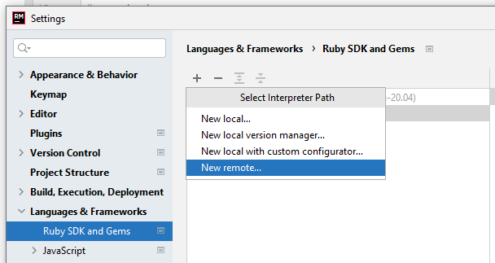
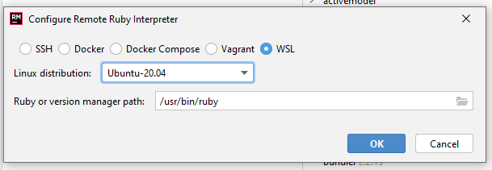

I've been playing with Windows Subsystem Linux or [WSL](https://docs.microsoft.com/en-us/windows/wsl/) for a while now and the advantages of having a working Linux kernel inside my OS (Windows 10). Among which is to be able to configure the Ruby interpreter for my IDE ([Rubymine](https://www.jetbrains.com/ruby/)) with the version of Ruby that I have installed in my wsl. For it I will continue with graphs that help in this configuration.

## Add an interpreter

1. Open the **Settings / Preferences**

2. In the **Ruby SDK and Gems** page, click the **+** button and select **New remote**:

3. Provide a path to the Ruby executable, for example:

   - /home/**user-name**/.rvm/rubies/ruby-**X.X.X**/bin/ruby for Ruby installations usin [rvm](https://rvm.io/).

   - /home/**user-name**/.rbenv/versions/**X.X.X**/bin/ruby for Ruby installations using [rbenv](https://github.com/rbenv/rbenv).

4. Udpate the interpreter path:

   - Ruby or version manager path: /home/**user-name**/.rbenv/versions/**X.X.X**/bin/ruby

## Summary

In this simple way we can take advantage of WSL to work with Ruby in a more efficient and comfortable way. In addition you can install the [New Windows Terminal](https://www.microsoft.com/es-cl/p/windows-terminal/9n0dx20hk701?rtc=1&activetab=pivot:overviewtab) to work with bash, powershell, cmd and others.

Thanks you for making it this far \o/.
